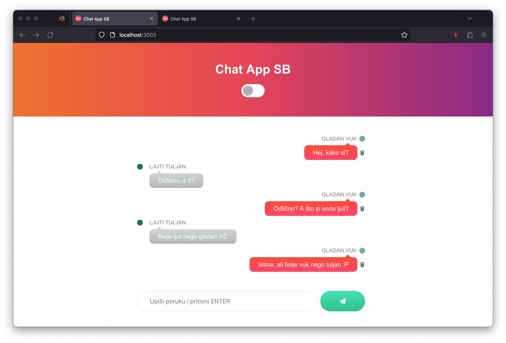
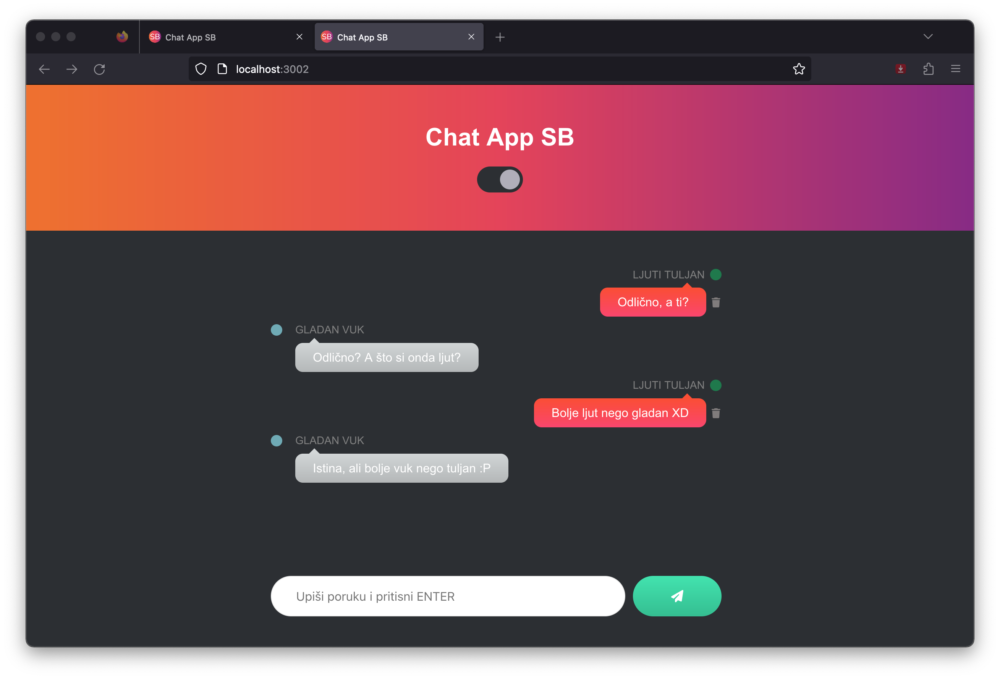

# Chat App SB {Saša Banjavčić}

Ovaj projekt je rađen kao završni ispit za Front-End Developera

## Tehnologije

Projekt je rađen u Visual Studio Codeu, pomoću:

- React 18.2.0
- Scaledrone

## Povezivanje na Scaledrone

- Besplatno se registriraj na [Scaledrone](https://www.scaledrone.com).\
- Izradi novi kanal, nakon čega dobiješ Channel ID, kojeg zalijepiš u .env datoteku
- Datoteku .env postavi u glavnom root folderu

```javascript
/* Datoteka .env > Scaledrone Channel ID */
REACT_APP_SCALEDRONE_CHANNEL_ID = Ovdje_Zalijepi_Channel_ID
```

## Instalacija

Instaliraj lokalno koristeći npm:

```
npm i
npm start
```

## Značajke

- Odabir teme svjetla/tamna
- Nasumični odabir imena člana
- Brisanje vlastite poruke
- Zvuk za slanje/brisanje poruke

## Screenshot

<p align="center">


</p>
